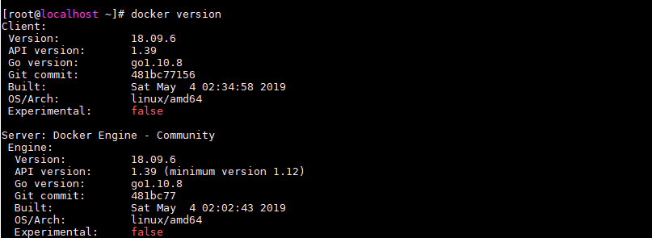

# step 1: 安装必要的一些系统工具

```
sudo yum update 
sudo yum install -y yum-utils device-mapper-persistent-data lvm2
```
# Step 2: 添加软件源信息

```
sudo yum-config-manager --add-repo http://mirrors.aliyun.com/docker-ce/linux/centos/docker-ce.repo
```

# Step 3: 更新并安装 Docker-CE

```
sudo yum makecache fast
sudo yum -y install docker-ce
```
# Step 4: 配置Docker服务

```
~]# mkdir  /etc/docker
~]# cat > /etc/docker/daemon.json <<EOF
{
  "registry-mirrors": ["https://o4uba187.mirror.aliyuncs.com"],
  "exec-opts": ["native.cgroupdriver=systemd"],
  "log-driver": "json-file",
  "log-opts": {
    "max-size": "100m"
  },
  "storage-driver": "overlay2",
  "storage-opts": [
    "overlay2.override_kernel_check=true"
  ]
}
EOF
~]# mkdir -p /etc/systemd/system/docker.service.d

```
# Step 4: 开启Docker服务

```
sudo systemctl  start docker
sudo systemctl  enable docker
```




> **注意**：其他注意事项在下面的注释中
- 官方软件源默认启用了最新的软件，您可以通过编辑软件源的方式获取各个版本的软件包。例如官方并没有将测试版本的软件源置为可用，你可以通过以下方式开启。同理可以开启各种测试版本等。

```
# vim /etc/yum.repos.d/docker-ce.repo
#   将 [docker-ce-test] 下方的 enabled=0 修改为 enabled=1
```

- 安装指定版本的Docker-CE

```
# Step 1: 查找Docker-CE的版本:
# yum list docker-ce.x86_64 --showduplicates | sort -r
#   Loading mirror speeds from cached hostfile
#   Loaded plugins: branch, fastestmirror, langpacks
#   docker-ce.x86_64            17.03.1.ce-1.el7.centos            docker-ce-stable
#   docker-ce.x86_64            17.03.1.ce-1.el7.centos            @docker-ce-stable
#   docker-ce.x86_64            17.03.0.ce-1.el7.centos            docker-ce-stable
#   Available Packages
# Step2 : 安装指定版本的Docker-CE: (VERSION 例如上面的 17.03.0.ce.1-1.el7.centos)
# sudo yum -y install docker-ce-[VERSION]
# 注意：在某些版本之后，docker-ce安装出现了其他依赖包，如果安装失败的话请关注错误信息。例如 docker-ce 17.03 之后，需要先安装 docker-ce-selinux。
# yum list docker-ce-selinux- --showduplicates | sort -r
# sudo yum -y install docker-ce-selinux-[VERSION]
```
