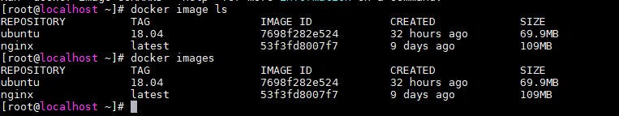

# 查询镜像：search


# 获取镜像：pull

镜像是运行容器的前提，我们可以自定义镜像下载仓库，或者通过 dockerhub 上下载镜像

- `~]# docker pull ubuntu:18.04`
    - -a, --all-tags=true|false：是否获取仓库中的所有镜像，默认为否
    - --disable-content-trust：取消镜像的内容校验，默认为真
    - --registry-mirror=proxy_URL：指定镜像代理服务地址


> 对 docker 镜像来说，如果不指定 TAG ，则默认使用 latest 标签， 这会下载最新的镜像

严格的来说，镜像的仓库名称还应该添加仓库地址 `registry` 作为前缀。例如：`docker pull registry.hub.docker.com/ubuntu:18.04`

# 查看镜像信息

- 使用 image 列出镜像：`docker image ls` 或者 `docker images`
    - 来自那个仓库
    - 镜像的标签信息
    - 镜像的 ID
    - 创建时间
    - 镜像大小



- 使用 tag 添加镜像标签：`docker tag ubuntu:18.04 myubuntu:18.04`

- 使用inspect 查看指定详细信息：`docker inspect ubuntu:18.04`
    - -f {{".Architecture"}} ：获取指定的内容

# 删除和清理镜像 rm | prune

#### 使用标签删除镜像 rmi

- 当一个镜像有多个标签时，我么能使用此命令删除指定标签：`docker rmi myubuntu:18.04`
    - -f, --force：强制删除镜像，即使有容器依赖它
    - -no-prune：不要清理未带标签的父镜像

> 不推荐使用 `-f` 强制删除一个存在容器依赖的镜像，建议，先删除以来此镜像的所有容器，再删除镜像

#### 清理镜像

使用 docker 一段时间后，系统可能会遗漏一些临时的镜像文件，已经一些灭有被使用的镜像， 可以通过 docker image prune 命令来清理。

- ` docker image prune -f`
    - -a, --all：删除所有无用镜像，不光是临时镜像
    - -filter filter：只清理符合给定过滤器的镜像
    - -f, --force：强制删除镜像，而不进行提示确认

# 创建镜像：commit、import、build 

#### 基于已有容器创建 `commit`

- 格式：`docker [container] commit [OPTIONS] CONTAINER [REPOSITORY[:TAG]`
    - -a ，--author=""：作者信息
    - -c，--change=[]：提交的时候执行Dockerfile指令
    - -m，--message=""：提交消息
    - -p，--pause=true：提交时暂停容器运行

> 实例：启动一个镜像，并在其中进行修改操作。然后使用commit命令提交制作成一个新的镜像 
```
[root@localhost ~]# docker run -it ubuntu:18.04 /bin/bash
root@7eaa8a1f5d19:/# touch test
# Ctrl+p; Ctrl+q退出容器，使用docker ps 获取到容器的镜像id  7eaa8a1f5d19 
~]# docker commit -m 'Add a new test file' -a "Dengyou" 7eaa8a1f5d19  test:0.1
```

#### 基于本地模板导入 `import`

- 格式：`docker [image] import [OPTIONS] file|URL| - [REPOSITORY[:TAG]]`


#### 基于 Dokcerfile 创建 `build`

- 格式：`docker build -t  python:3.0`

# 存储和载入镜像

#### 存储镜像 `save`

- 格式：` docker save -o ubuntu_18_04.tar ubuntu:18.04`

#### 载入镜像

- 格式：`docker load -i ubuntu_18_04.tar` 或 ` docker load < ubuntu_18_04.tar`

# 上传镜像 `push`

先给镜像打 tag ,然后push

- 格式： `docker tag ubuntu:18.04 dengyou/ubuntu:18.04`
- 格式： ` docker push dengyou/ubuntu:18.04`


