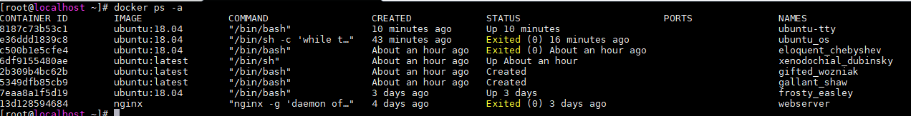

镜像是静态的，容器是动态的，镜像运行起来则为容器

# 创建容器

#### 新建容器

- **run**：`docker run -it  ubuntu:18.04  /bin/bash`
- **run**: ` docker run  --name=ubuntu_os -d  ubuntu:18.04 /bin/sh -c "while true; do echo hello world; sleep 1;done"`
- **create**：`docker create -it ubuntu:18.04` 
- **start**：`docker start  xenodochial_dubinsky`

# 停止容器

#### 暂停容器：`pause`

- `docker pause ubuntu_os`
- `docker unpause ubuntu_os`

#### 终止容器

- **stop**：` docker stop ubuntu_os`
- **restart**：`docker restart ubuntu_os`

# 进入容器

```
~]# docker run  --name=ubuntu-tty  -itd ubuntu:18.04
```
- **attach**：`docker attach ubuntu-tty`

> Note: 当多个窗口 `attach` 到同一个容器时，所有窗口会同步显示，当否个窗口卡住是，其他窗口就无法操作了，exit 推出容器时容器也会退出； 所以正确的退出方式：`ctrl+p` + `ctrl_q`

- **exec**：`docker exec -it ubuntu-tty /bin/bash`

> 打开一个新的终端，在不影响容器的其它应用的前提下，用户可以与容器进行交互，同时 `exit` 时， 容器不会跟着退出

# 删除容器


- **rm**: ` docker rm webserver`

> 默认情况下 rm 只能删除一个运行中的容器，可以添加 -f 参数删除运行中的容器 `docker rm -f  8187c73b53c1`

# 容器的导入导出

#### 导出容器 `export`

- `docker export -o ubuntu.tar   5349df`
- `docker export  5349dfb8 > ubuntu2.tar`

#### 导入容器 `import`

导出的容器可以使用 import 命令导入为镜像

- `docker import ubuntu.tar test/ubuntu:v1.0`

# 查看容器

#### 查看容器详情 `inspect`

- `docker container inspect 7eaa8a1f5d19`

#### 查看容器内进程 `top`

-  `docker container top 7eaa8a1f5d19`

#### 查看统计信息：`stats`

- `docker container stats -a 7eaa8a1f5d19`
