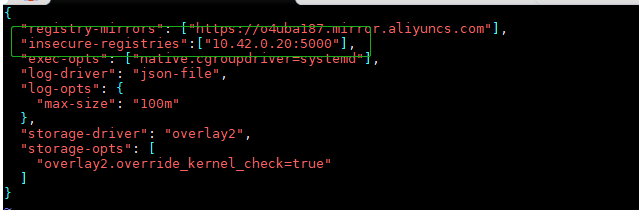

# 使用 registry 镜像创建私有仓库

安装 docker 后，通过官方提供的 registry 镜像来搭建一套本地私有仓库环境。默认情况下，仓库会被创建在容器的 `/var/lib/registry` 目录下，可以通过 -v 参数来将镜像文件存放到本地指定的路径。例如下面的例子将商场的镜像放到 `/opt/data/registry` 目录：

```
 ~]# docker run -d -p 5000:5000 -v /opt/data/registry:/var/lib/registry registry:2
```

要想客户端能够使用，需要配置 docker 的启动参数：`insecure-registries"`



```
~]# docker tag nginx:latest 10.42.0.20:5000/nginx:v0.1
~]# docker push 10.42.0.20:5000/nginx:v0.1
```

**查看 `Registry` 仓库中有那些镜像**：` curl http://10.42.0.20:5000/v2/_catalog`