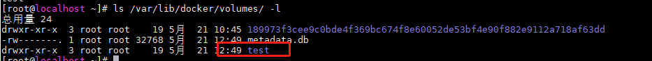

生产环境中使用 Docker，往往需要对数据进行持久化，或者需要在多个容器之间捷星数据共享。容器中管理数据的方式主要有两种：
- 数据卷（Data Volumes）：容器内数据直接映射到本地主机环境
- 数据卷容器（Data Volume Contaniners）：使用特定容器维护数据卷

# 数据卷（Data Volumes）

数据卷是一个可供容器使用的特殊目录，它将主机操作系统目录直接映射进容器，类似于 Linux 中的 mount 行为。

特性：
- 数据卷可以在容器之间共享和重用，容器间传递数据变得高效方便
- 对数据卷内数据修改立马会生效，无论是在本地擦欧总还是在容器内操作
- 对数据卷的更新不会影响到镜像，解耦应用和数据
- 卷会一直存在，知道没有容器使用，可以安全的卸载它

#### 创建数据卷 `volume`

```
 ~]# docker volume create -d local test
```



#### 绑定数据卷

除了使用 volume 子命令管理书卷外，还可以在创建容器时，将本地的任意路径挂载到容器内作为数据卷，这种形式创建的数据卷叫绑定数据卷

```
~]# docker run -it --name=busybox -v /data/host_path:/data/container_path busybox
```
> 路径会自动创建，无须事先存在


# 数据卷容器 (Data Volume Contaniners)

如果用户需要在多个容器间共享一些持续更新的数据，那么就推荐使用容器卷。

- 制作基础镜像卷`~]# docker run -it -v /web/html  --name busybox busybox`


> 如果 -v 只跟一个参数，那么指定的时容器内的路径

- 使用 `--volumes-from` 挂在 busybox 容器中的数据卷`~]# docker run -it --volumes-from busybox --name other_container ubuntu:18.04`


