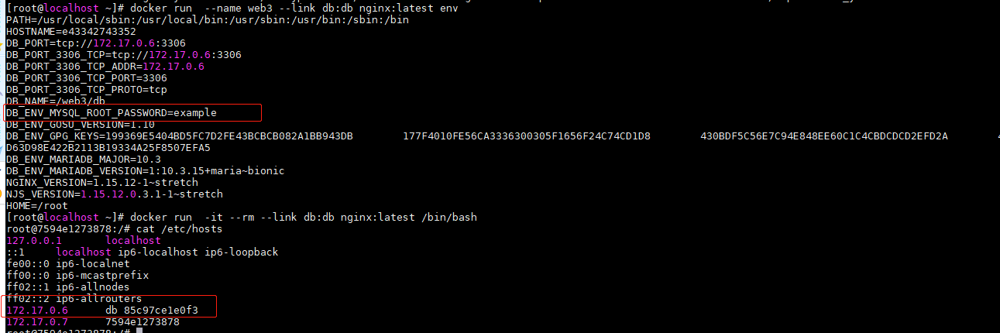

- 允许映射容器内应用的服务端口到本地宿主主机
- 互联机制实现多个容器间通过容器名来快速访问

# 端口映射实现容器访问

#### 从容器外部访问应用

- `-p`：指定宿主机端口8080：`docker run -d -p 8080:80 --name web_8080 nginx:latest`
- `-P`:随机映射宿主机端口：`docker run -d -P --name=suiji_web nginx:latest`

# 容器互联

**使用 `--link` 参数可以让容器之间安全地进行交互**

```
# 创建一个数据库容器
~]# docker run -itd --name db --env MYSQL_ROOT_PASSWORD=example mariadb
85c97ce1e0f330277ea8a89b0a59442abacdcd10640a9d584386e4f3be1c3de1
~]# docker ps |grep mariadb
85c97ce1e0f3        mariadb             "docker-entrypoint.s…"   35 seconds ago      Up 33 seconds       3306/tcp                 db
```

```
# 创建一个web容器并将它连接到db容器  
~]# docker run -itd -P --name web --link db:db nginx:latest
53855d2e32bf08a33799da479bddaa6557b341737b505542d9a9a8eaf1be49be
~]# docker ps
CONTAINER ID        IMAGE               COMMAND                  CREATED             STATUS              PORTS                    NAMES
53855d2e32bf        nginx:latest        "nginx -g 'daemon of…"   7 seconds ago       Up 6 seconds        0.0.0.0:32770->80/tcp    web
85c97ce1e0f3        mariadb             "docker-entrypoint.s…"   2 minutes ago       Up 2 minutes        3306/tcp                 db
```

- `--link` 参数的格式为：`--link name:alias` ，name 为要连接的容器名称， aliase 是这个连接的别名

> Docker相当于在两个互联的容器之间创建了一个虚拟通道，而不用映射它们的端口到宿主机上。在启动db容器的时候并没有使用-p或者-P参数，从而避免了暴露数据库服务端口到外部网络上。



- 其中DB_开头的环境变量是提供web容器连接db容器使用的，前缀采用大写的连接别名。
- 这里有两个hosts信息，第一个是db容器的IP和容器名+容器ID，第二个是web自己的IP和容器ID，web容器中hosts文件采用容器的ID作为主机名,互联的容器之间是可以ping通的。
